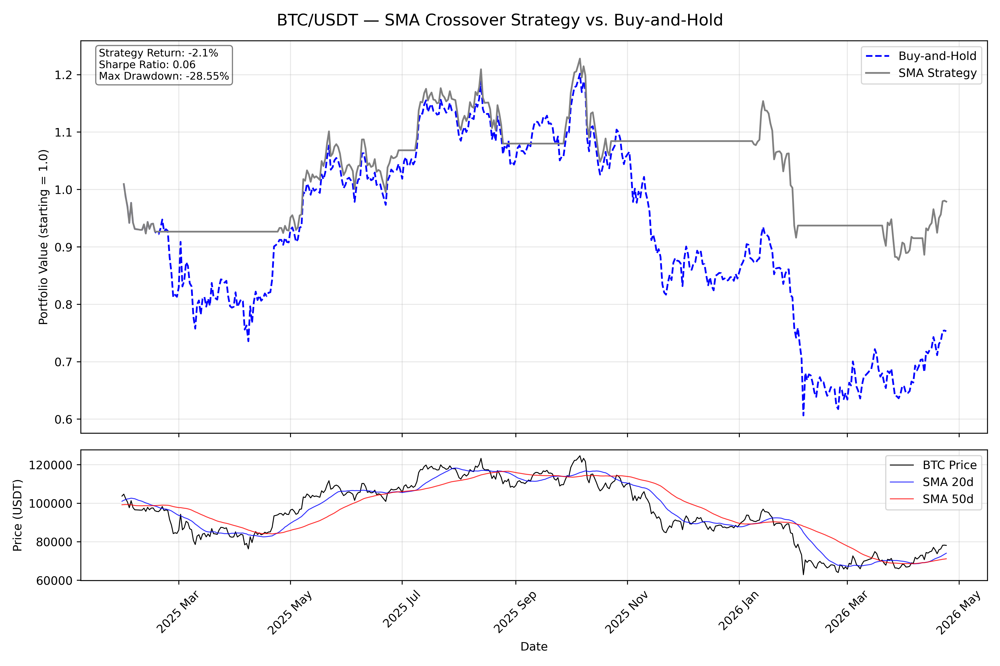

# BTC/USDT SMA Crossover Backtest

A quantitative backtest of a Simple Moving Average crossover strategy on Bitcoin daily price data, built from scratch in Python.

## Strategy
- **Signal**: Buy when the 20-day SMA crosses above the 50-day SMA; sell to cash when it crosses below.
- **Data**: Daily OHLCV from Binance via `ccxt` (~500 days)
- **Lookahead bias**: Avoided by shifting signals by 1 period.

## Performance Metrics
| Metric | Value |
|---|---|
| Strategy Total Return | -2.1% |
| Sharpe Ratio | 0.06 |
| Max Drawdown | -28.55% |

## Setup
```bash
pip install ccxt pandas numpy matplotlib
python backtest.py
```

## Assumptions & Limitations

This backtest operates under idealised market conditions:

- **No transaction costs**
- **No slippage**
- **Instant execution**
- **Perfect fills**

These assumptions cause backtests to systematically overestimate real-world performance. A production system would model fees and slippage explicitly.

## Output
